# 风雨同行：中国气象数据的奇妙之旅
本可视化项目旨在通过图表、地图和动态展示，呈现中国丰富而多样的气象数据，从而深入了解气象现象对不同地区的影响。通过可视化，我们将揭示中国的气温分布、降水情况、风速趋势等关键数据，为观众呈现大自然的变幻莫测与秩序井然。这个项目将带领观众探索中国广袤的气象景观，为我们更好地理解天气背后的故事提供一个生动而直观的视角。

## 数据获取
依照国家气象信息中心等其他网站获取2023年1-11月日照时间、降雨量、温度、风速等相关数据。 
获取数据网站：https://data.cma.cn/,https://rp5.ru..  

## 页面构成
### 首页
首页包含导航栏和自动跳转至数据分析和地图分析的按钮。 
 
### MAP页面
MAP页面通过按钮切换可以选择不同类型的气象数据，包括日照长度、降雨量、风速、空气污染指数和温度五个方面的数据，同时选择右上角的月份可以实现不同月份相关气象数据的查看。 
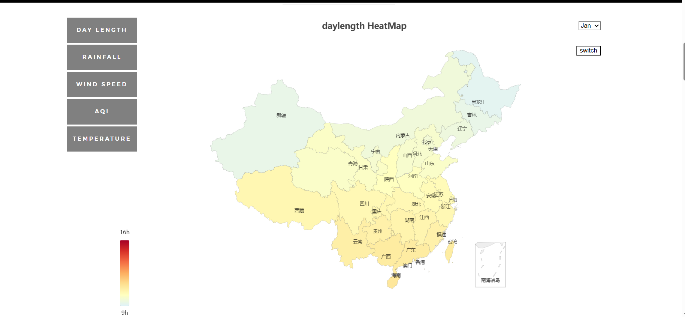 
将鼠标放置在某省份上会出现该省份的相关信息。 
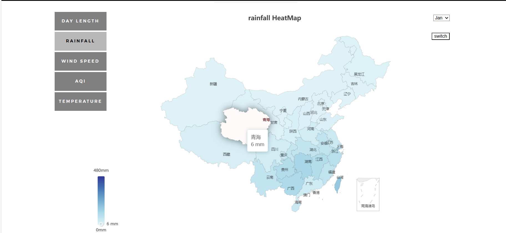 
点击swith按钮会将地图模式转换为不同省份的柱状图，由此对比各个省份更为清晰。 
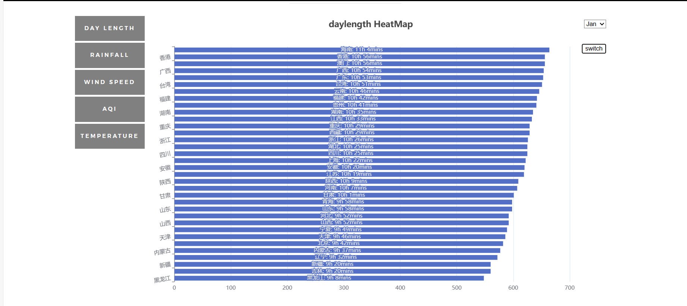 
### MORE页面
MORE页面在MAP页面的基础上对相关气象数据分别进行进一步分析。 
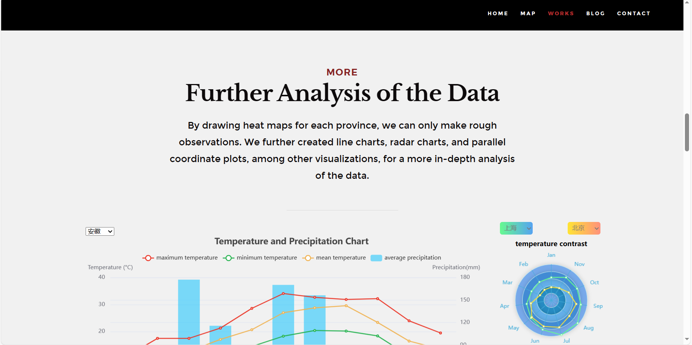 
通过柱状图和折线图的结合，可以选择不同省份从而查看该省份1-11月降雨量、最高温度、最低温度和平均温度的数据。 
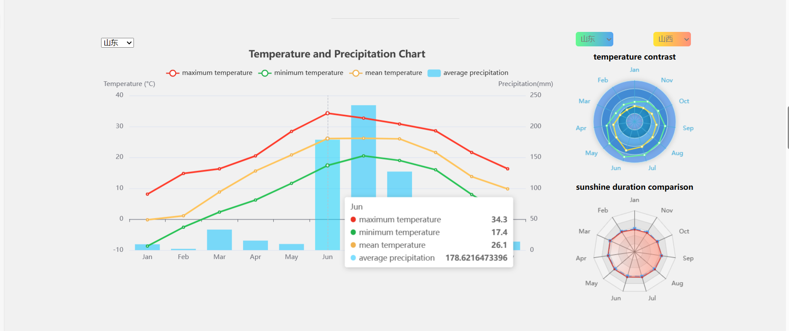 
接着，我们应用雷达图，可以自由选择两个省份以便对比两个省份1-11月气温和日照长度的差别。 
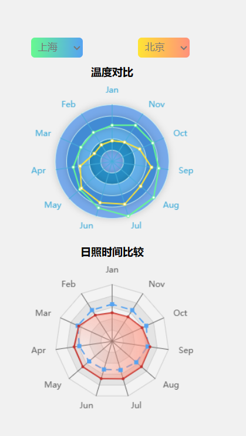 
同时，我们还依据现有数据绘制了省市县三级的降雨可视化，点击该省、市会显示下一级相关数据信息。 
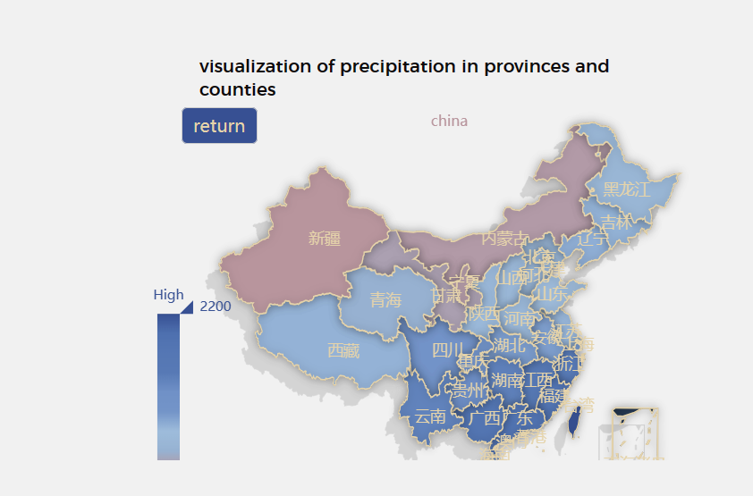 
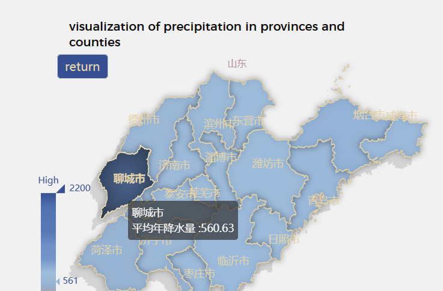 
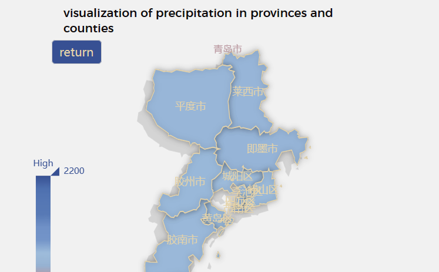 
为使得风向数据清晰可视化，我们结合百度地图绘制风场图，可通过选择对不同月份进行查看。 
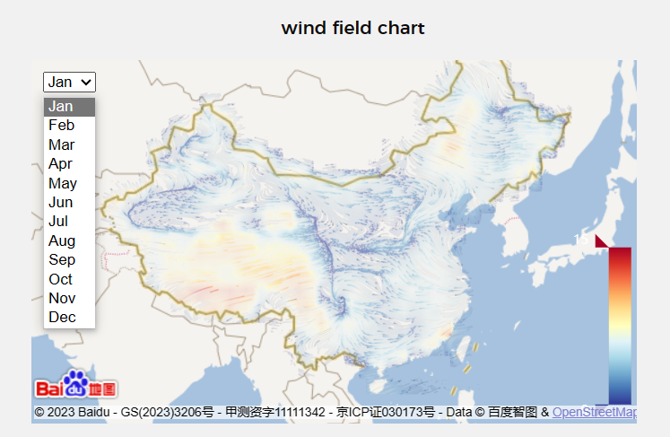 
最后，我们对东北、华北、华东、华中、西北、西南五个地区各月份各污染物进行分析。由左边列表可以查看空气污染物的占比，右边平行坐标图可以查看五个地区不同月份的空气污染物程度。 
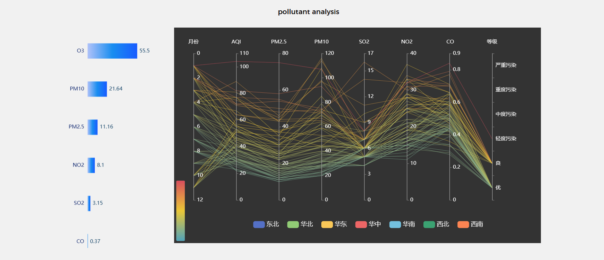 
### BLOG页面
BLOG页面主要记录了我们的实验进度。 
 
最后记录了我们项目的github地址和小组各成员分工。
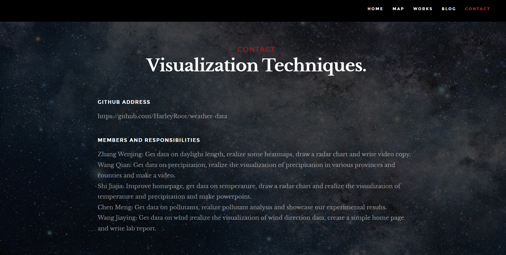 

## 交互逻辑
### 首页
1.导航栏可以直接跳转至相关内容； 
2.按键1可以直接跳转至热力图，按键2直接跳转至数据的进一步分析。 
### 热力图
1.左边栏可以选择不同气象数据进行查看； 
2.右边下拉框可以选择不同月份； 
3.右边swith按键可以将地图形式转换为柱状图； 
4.将鼠标放置在省份上可具体显示省份相关信息。 
### MORE页面
#### 气温和降雨图表
1.左边下拉框选择不同省份； 
2.点击图标可显示或隐藏该图标有关信息； 
3.将鼠标放置在某列上可具体显示该列相关信息。 
#### 气温和日照长度雷达图
1.下拉框选择可对比两个省份的信息； 
2.将鼠标放置在雷达图上可具体显示该省份11个月的信息。 
#### 各省市县三级降雨图
1.点击省份、市可进一步进入该省份包含的市和该市包含的区县； 
2.将鼠标放置在省份上可具体显示相关信息。 
#### 风场图
1.左边下拉框选择不同月份； 
2.鼠标滚动可实现地图的缩放。 
#### 污染物分析图
1.点击图标可选择显示或隐藏该图标有关信息； 
2.将鼠标放置在不同颜色的线上可具体显示污染程度。 
